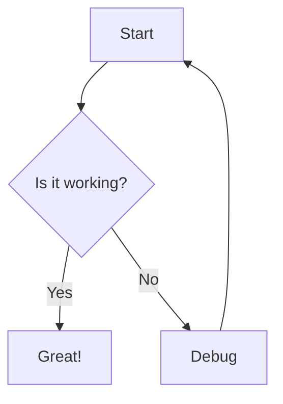
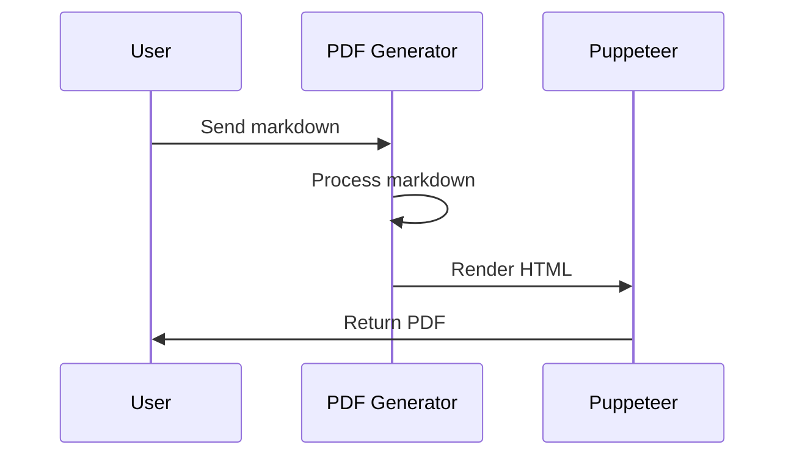

# 100% Complete Markdown Test Document

[[TOC]]

## Overview

This document demonstrates **100% markdown support** in the PDF generator, including all advanced features.

## Math Support

### Inline Math
The quadratic formula is $x = \frac{-b \pm \sqrt{b^2 - 4ac}}{2a}$ where $a \neq 0$.

### Block Math
$$
\int_{-\infty}^{\infty} e^{-x^2} dx = \sqrt{\pi}
$$

$$
E = mc^2
$$

## Footnotes

This is a statement that needs a citation[^1]. Here's another important fact[^2].

[^1]: This is the first footnote with additional information.
[^2]: This is the second footnote with a [link](https://example.com).

## Subscript and Superscript

- Water formula: H~2~O
- Mathematical expression: x^2^ + y^2^ = z^2^
- Chemical notation: CO~2~ emissions increased by 10^6^ tons

## Definition Lists

API
: Application Programming Interface

HTML
: HyperText Markup Language

CSS
: Cascading Style Sheets

## Abbreviations

The HTML specification is maintained by the W3C. When writing CSS, always consider browser compatibility.

*[HTML]: HyperText Markup Language
*[CSS]: Cascading Style Sheets
*[W3C]: World Wide Web Consortium

## Task Lists

### Project TODO
- [x] Implement basic markdown support
- [x] Add advanced formatting features
- [x] Support math equations with KaTeX
- [x] Implement footnotes
- [ ] Add real-time preview
- [ ] Implement collaborative editing

## Mermaid Diagrams





## Combined Features Example

> [!TIP]
> **Pro tip:** You can combine ==highlighting==, *italics*, and math $e^{i\pi} + 1 = 0$ in callout boxes!

Here's a complex list with various features:

1. **First item** with `inline code`
   - Sub-item with ==highlighting==
   - Math formula: $\sum_{i=1}^{n} i = \frac{n(n+1)}{2}$
2. Second item with a footnote[^3]
   - [x] Completed task
   - [ ] Pending task with ~subscript~ and ^superscript^
3. Third item with abbreviation: Use HTML and CSS

[^3]: This footnote demonstrates that footnotes work in lists too!

## Advanced Table

| Feature | Status | Math Example | Notes |
|---------|--------|--------------|-------|
| **Bold** | ✅ Supported | $a^2$ | Works everywhere |
| *Italic* | ✅ Supported | $\sqrt{x}$ | Including tables |
| ==Highlight== | ✅ Supported | $\int f(x)dx$ | Yellow background |
| H~2~O | ✅ Supported | $e^{i\theta}$ | Subscripts work |
| x^2^ | ✅ Supported | $\lim_{x \to \infty}$ | Superscripts too |

## All Heading Levels Test

# Heading 1
## Heading 2
### Heading 3
#### Heading 4
##### Heading 5
###### Heading 6

## Text Alignment

Regular left-aligned text.

->Centered text with **bold** and *italic*<-

>>Right-aligned text with `code`

## Code with Syntax Highlighting

```python
def calculate_factorial(n: int) -> int:
    """Calculate factorial using recursion with memoization."""
    if n <= 1:
        return 1
    return n * calculate_factorial(n - 1)

# Test with math in comments: e^(i*pi) + 1 = 0
result = calculate_factorial(5)  # Returns 120
```

## Full Feature Integration

> [!NOTE]
> This section combines **all features**:
> - Math: $\frac{\partial f}{\partial x} = 2x$
> - Footnote reference[^4]
> - ==Highlighted text==
> - Definition list below:
>
> PDF
> : Portable Document Format
>
> - Task list:
>   - [x] All features implemented
>   - [x] 100% markdown support achieved

[^4]: Final footnote demonstrating everything works together!

---

->**🎉 100% Complete Markdown Support Achieved! 🎉**<-
